# code-semantics

A Java library that states what subject matter a source repository is concerned with, by reading the words in the names its authors declared.



The bar carries the topics whose figures exceed chance resampling, longest first, each as long as the share of the reading it accounts for. [The sunburst](output/themes-chart.html) answers a second question: it draws **every** topic the reading observed, arranged on the topic resource's own hierarchy, with the broad subjects on the inner ring and their children outside them. A topic absent from the bar still appears there, and a wedge is sized by its share of everything written.

## What it does

- **Reads a local directory.** No clone, no fetch, no compile, no type resolution — a repository that does not build is still readable, and so is a pull request.
- **Counts only the names a repository declares.** `String`, `List` and `assertThat` belong to the platform and to third-party libraries; a repository referencing them has said nothing about its own subject. A parse distinguishes a declaration from a reference, so the reading runs on a parse tree.
- **Looks each word up in published resources** — WordNet, WordNet Domains, Wiktionary's topic vocabulary, a published frequency list — and records what each resource says the word is about.
- **Adds that up into a distribution over subjects**, weighting each [phrase](#definitions) once however long it is, per [scope](#definitions) and for the repository.
- **Compares distributions**: a scope against the whole repository, the repository against a published subject scheme, and every declared name against a published term taxonomy.
- **Reports nothing that chance would have produced.** Worked example: `lexicon/src/main/java` sits some distance from the whole repository's distribution. To find out whether that distance means anything, the reading draws 999 samples of the same number of files from the same repository and measures the same distance for each. The scope is reported only if its distance is larger than every one of those 999 — the `1/(n+1)` quantile, set that high because every scope is tested at the same time. A scope that fails is named, and its figure is printed nowhere.

### Grammar rules only, no hard-coded lists

> Every signal is weighted evidence taken from a published resource that can be cited. No hand-written vocabulary, no exclusion list, no override.

| Rule | Consequence |
|---|---|
| **A word tells you about subject matter only where a dictionary carries it as a noun, a verb or an adjective.** `the`, `of` and `and` are how English holds a sentence together, and `e`, `s` and `i` are symbols standing in for something else. Neither kind says anything about what the code is for, so neither counts | WordNet's own coverage decides which words those are, so this repository holds no stop list |
| **Where no resource has an entry for a word, the reading records that it saw the word and says nothing further about it.** A guessed subject would be an invention; a score of zero would be a claim in its own right, lowering every average that includes it | The word stays in the total, so λ states what share of the text the reading could use at all |
| Every statistic has a maximum that follows from its definition | A share bounds itself at 1, a [Jensen–Shannon divergence](#references) at 1 bit. [Kullback–Leibler divergence](#references) is unbounded, so nothing here uses it |
| A piece of evidence cannot be built without its source | Constructing one requires a [`SourceAnchor`](code-semantics-api/src/main/java/org/fifties/housewife/codesemantics/repository/SourceAnchor.java) naming the resource and the line |
| Splitting rules are allowed; word lists are not | A capital letter divides `adjectivePhrase` into two words, which is a rule about spelling. Which of those two words means anything is a published dictionary's answer |

## Running it

| Command | What it does |
|---|---|
| `./gradlew selfRead` | reads this repository and writes the reports linked below |
| `./gradlew selfRead -Dcs.clone.dir=<path>` | reads another checkout, and keeps its reports separate |
| `./gradlew panelFetch -Dcs.panel.dir=<dir>` | fetches each backtest member at its pinned commit |
| `./gradlew panelRead -Dcs.panel.dir=<dir>` | reads every member of the backtest panel |
| `./gradlew wordVotes -Pwords="cite source"` | every subject each resource gives those words, and what each is worth |
| `./gradlew wordPlace -Pwords="get set list"` | where those words stand in the vocabulary ranking, and which reference scored each of them down |
| `./gradlew topicCarriers -Ptopics="linguistics"` | every word that produced a topic's score, with its share |
| `./gradlew abbreviatedTypes` | every declared name that is the initials of its own type |
| `./gradlew checkAll` | tests and coverage verification |

Java 21 toolchain, `-Xlint:all -Werror`, Error Prone, an 80% JaCoCo instruction floor per module.

### What a run tells you

- [**The whole analysis, step by step**](output/index.html) — every figure in the order the reading produced it. Start here.
- [**The topics, with the evidence behind each**](output/summary.md) — every topic whose figure exceeds all 999 chance resamples, its distance in bits, and the words and lines that produced it.
- [**How much of the repository could be read at all**](output/self-reading.md) — λ, the files that would not parse, and the words no resource could be cited for.
- [**The words and phrases that carry the most signal here**](output/vocabulary.md) — every declared word ranked against ordinary English and against the Java platform's own API. A word both references write more often than this repository does scores lower than one neither of them writes.
- [**What each scope is about**](output/themes.md) — with the words that produced each topic's score, and the line each was written on.
- [**Where it stands among published subjects**](output/subjects.md) — the nearest of the 152 subject categories [arXiv](https://arxiv.org/category_taxonomy) publishes to classify scientific papers, from `cs.CL` Computation and Language to `math.AG` Algebraic Geometry. The nearest real category must be nearer than the nearest of a set of categories built by shuffling the real ones.
- [**Which published taxonomy terms the declared names match**](output/terms.md) — per normalisation level, and every one-word match discarded for standing alone in its part of the taxonomy (see [corroboration by branch](#matching-against-published-taxonomies)).
- [**The field drawn as a tree**](output/taxonomy.html), with the branches this repository writes highlighted, and [**every match with the line it was written on**](output/evidence.html).

## Definitions

Each term below has an everyday meaning too. The technical one is meant.

| Term | Meaning here |
|---|---|
| **scope** | one directory the build compiles as a unit — `<module>/src/<set>/java`, so `lexicon/src/main/java` and `lexicon/src/test/java` are two — or the repository's documentation. A package or a single file is not a scope |
| **phrase** | one declared name, or one sentence of prose. It is the unit of evidence: each contributes a single unit of mass whatever its length, so a long javadoc sentence cannot outweigh a short field name |
| **sense** | one of the distinct meanings a dictionary lists under a word, as [WordNet](#references) enumerates them. `cite` has several, one of them summoning a defendant to court |
| **headword** | the word itself, with its senses pooled — the form a dictionary indexes |
| **lemma** | the dictionary form of an inflected word, as [WordNet](https://wordnet.princeton.edu/) indexes it: `citations` → `citation` |
| **λ (legibility)** | the share of word occurrences any bundled resource could be cited for |
| **span** | one match of a published taxonomy term inside a declared name |
| **rung** | one step a publisher states between a concept and the root of its branch |

## What the parse takes

| Category | Taken | Weight per phrase |
|---|---|--:|
| Declared names | types, methods, fields, parameters, locals, record components, constants, pattern bindings, labels, the distinguishing segment of the package | 1.0 |
| Dependencies | imports belonging neither to the Java platform nor to the repository under analysis | 0.5 |
| Prose | javadoc, comments, and markdown the repository has not declared to be a working note | 0.5 |

In four positions the syntax fixes the name, so the name says nothing about subject matter. Each is a rule about the parse:

- **A dependency's package path** states somebody else's coordinates in its leading segments.
- **A catch clause's parameter** stands for the type the language requires beside it. Every catch clause in this repository names it `e`, and so do 1,675 of Apache Tika's 1,744 short ones.
- **A name that is the initials of the words of its own type** stands for that type: `TikaInputStream tis`, `StringBuilder sb`, `InputStream is`. Length plays no part in the rule, so `String id` — whose type spells `s` — keeps its rank.
- **A javadoc's tags** belong to the Javadoc format. A block tag's name, a `@param` name (already read where the parameter was declared) and whatever `{@link}` points at are all discarded, and the format's own structure identifies them.

Two more positions decide whether a name belongs to the repository or to the build around it: a package is one naming decision however many files sit under it, so it is read once; and an import is read only in a source set the build publishes, which removes `junit`, `assertj` and `j2html` without naming a library.

## How a name becomes a subject

Worked example: the field `private final CitationSource citationSource;`. [The same sequence, with this repository's own figures](output/index.html).

| | Step | On the example | Class |
|--:|---|---|---|
| 1 | The parse keeps the declaration and drops the use | `citationSource` is kept; the type `CitationSource` at this position is a use | [`ParsedRepository`](code-semantics-engine/src/main/java/org/fifties/housewife/codesemantics/engine/parse/ParsedRepository.java) |
| 2 | Split at case transitions and separators | `citation`, `source` | [`Tokeniser`](code-semantics-api/src/main/java/org/fifties/housewife/codesemantics/name/Tokeniser.java), [`IdentifierWords`](code-semantics-engine/src/main/java/org/fifties/housewife/codesemantics/engine/reading/IdentifierWords.java) |
| 3 | Price a glued run against a frequency list, and keep whole any run the dictionary carries | `userid` → `user`, `id`; `abstains` stays one word | [`WordSegmenter`](code-semantics-api/src/main/java/org/fifties/housewife/codesemantics/name/WordSegmenter.java), [`PieceCost`](code-semantics-api/src/main/java/org/fifties/housewife/codesemantics/name/PieceCost.java) |
| 4 | Fold a published run of words into one term | `partOfSpeech` → `part of speech`, one term counted once | [`CollocatedWords`](code-semantics-engine/src/main/java/org/fifties/housewife/codesemantics/engine/theme/CollocatedWords.java) |
| 5 | Discard a word carrying no subject matter, and take the lemma of the rest | *of*, *and*, *which* leave; `citations` → `citation` | [`ContentWords`](code-semantics-engine/src/main/java/org/fifties/housewife/codesemantics/engine/theme/ContentWords.java), [`WordMorphology`](code-semantics-api/src/main/java/org/fifties/housewife/codesemantics/name/WordMorphology.java) |
| 6 | Collect what each resource says the word is about | `cite` → `law`, from the sense about summoning a defendant | [`TopicCitations`](code-semantics-engine/src/main/java/org/fifties/housewife/codesemantics/engine/theme/TopicCitations.java) |
| 7 | Count each label once, however many ancestors it arrives with | a word labelled `computing` arrives labelled `engineering`, `mathematics`, `natural-sciences`, `physical-sciences` and `sciences` as well, because the resource publishes every ancestor alongside the label. Counted as six, one statement about one word would be six times the evidence, so the five ancestors are folded back into `computing` | [`StatedTopics`](code-semantics-engine/src/main/java/org/fifties/housewife/codesemantics/engine/theme/StatedTopics.java) |
| 8 | Weight each label, add them up per scope, and test the result against chance | one distribution over subjects per scope, and the distance each scope must exceed to be reported | [`TopicDistribution`](code-semantics-engine/src/main/java/org/fifties/housewife/codesemantics/engine/theme/TopicDistribution.java), [`PermutationNull`](code-semantics-engine/src/main/java/org/fifties/housewife/codesemantics/engine/theme/PermutationNull.java) |

### Where one word ends and the next begins

The rules come from [UAX #29](https://www.unicode.org/reports/tr29/), the Unicode standard for text segmentation. Two of its word-boundary rules cover cases a splitter working from capital letters alone gets wrong:

| Rule | What it states | Effect |
|---|---|---|
| WB9, WB10 | a letter next to a digit is not a boundary | `utf8Decode` reads as `utf8` and `decode` |
| WB6, WB7 | a letter either side of an apostrophe is not a boundary | `resource's` is one word. Split at the apostrophe, the trailing `s` reaches the dictionary, which carries it as a noun |

### Where each weight comes from

| Weight | Definition | Where it comes from |
|---|---|---|
| Sense coverage | labelled senses ÷ total senses | both counts from WordNet. The domain resource states in its own header that it omits domain-less senses |
| Specificity | `log(rank) / log(size)` | a published frequency list, which bounds it in `[0, 1]` by its own length |
| Phrase agreement | geometric mean over the words that agree on a subject, times the share of the phrase's words that agree | the words of the phrase, read together. On its own, `cite` could be law (summoning a defendant), linguistics or publishing. The name is `citationSource`, so the reading scores the pair: `citation` and `source` both carry publishing, neither carries law, and publishing is what the name is scored for |

### Why a raw word count is not enough

The words a Java program contains most of are the words *every* Java program contains most of. Each word is therefore scored against the rate at which two references write it:

| Reference | What it states | What it scores down that the other cannot |
|---|---|---|
| The bundled frequency list | what ordinary English is written in, as a rank per word | `the`, `of`, `that` |
| [`PlatformVocabulary`](code-semantics-engine/src/main/java/org/fifties/housewife/codesemantics/engine/vocabulary/PlatformVocabulary.java), from `ModuleFinder.ofSystem()` | what ordinary Java is written in: every type name and every public or protected method name the platform declares in its exported packages, split by the same grammar | `get`, `set`, `value`, `map`, `object`, `list`, `string`, which a frequency list of English finds *specialist* |

The second asks the running JDK to describe itself, the same delegation [`PlatformPackages`](code-semantics-engine/src/main/java/org/fifties/housewife/codesemantics/engine/parse/PlatformPackages.java) uses to sort an import. [`ClassFileMethods`](code-semantics-engine/src/main/java/org/fifties/housewife/codesemantics/engine/vocabulary/ClassFileMethods.java) reads the method names from each class file's constant pool, loading no class. A word ranks high only where both references write it less often than this repository does; where a reference writes it more often, its score falls and it keeps its place in the table. [See the whole ranking](output/vocabulary.md).

## Matching against published taxonomies

| Kind | Example | How it is used |
|---|---|---|
| **Subject scheme** — classifies whole documents | the [arXiv category taxonomy](https://arxiv.org/category_taxonomy): 152 categories the preprint archive uses to file scientific papers, each with a published description | as a reference distribution. Its category names never appear in code, so the reading pools each category's own description through the same pipeline and compares distribution against distribution |
| **Term taxonomy** — names the terms a field's practitioners use | [OLiA](https://github.com/acoli-repo/olia), [FIBO](https://spec.edmcouncil.org/fibo/) | matched against declared names. OLiA publishes `AdjectivePhrase`; a repository may declare `adjectivePhrase`, and both split into the same two words |

**Every taxonomy is converted to [SKOS](https://www.w3.org/TR/skos-reference/) before it is read** — the W3C model for published vocabularies: each concept has a preferred label, any number of alternative labels, and `broader`/`narrower` links to its neighbours. OLiA arrives as OWL and FIBO as RDF/XML; both become the same rows, so the matcher and the branch rule work the same way whatever the publisher used.

[`TermSpans`](code-semantics-engine/src/main/java/org/fifties/housewife/codesemantics/engine/term/TermSpans.java) takes the longest published term at each position, left to right, with no two matches overlapping. A prefix that is not itself a published term is not evidence.

**Three normalisation levels, reported separately and never summed:**

| Level | Both sides reduced to | Source | Status |
|--:|---|---|---|
| 1 | the sequence of words itself | a string comparison | in use |
| 2 | the lemma of each word | WordNet's lemma index | in use. `phrases` matching `Phrase` is an inflection of the same word |
| 3 | the synset of each word | WordNet's sense entries | **measured and discarded as evidence.** WordNet has no entry for *base form*, resolves *article* to a piece of writing, and puts `subject`, `theme` and `Topic` in one synset. Still reported, contributing to nothing |

**Corroboration by branch.** A taxonomy is a tree: every concept sits under a parent, beside sibling concepts the publisher placed there. A match on a single word counts only where the repository also writes at least one of that concept's siblings. Writing several concepts from one part of a field is evidence of working in it; writing a single one is what an ordinary English word the taxonomy has claimed produces.

Worked example: OLiA places `Preferred` under `UsageAndFrequencyFeature`, beside `Rare`, `Common` and the rest. This repository writes `Preferred` once and none of its siblings, so the match is discarded. `Verb` survives, because `Noun`, `Clause` and `Phrase` are written too. A match of more than one word — Tika's `AdjectivePhrase` against OLiA's — needs no such support, because two words matching by chance is far less likely than one.

**The two bundled taxonomies:**

| Taxonomy | Field | What it tests |
|---|---|---|
| [OLiA](https://github.com/acoli-repo/olia) — Ontologies of Linguistic Annotation | linguistic annotation | the in-domain case: a vocabulary of grammar should match a library built from lemmas and senses |
| [FIBO](https://spec.edmcouncil.org/fibo/) — Financial Industry Business Ontology | finance | the out-of-domain case: a vocabulary of finance should match almost nothing in it |

A vocabulary matching inside its own domain establishes nothing, because any sufficiently large word list matches something somewhere. What has to be shown is that it produces few or no matches outside that domain.

**No term match contributes to the topic distribution**, because the matcher has so far run against this repository only.

## Modules

| Module | Contents |
|---|---|
| `lexicon` | the bundled lexical resources and the code that reads them: WordNet via extjwnl, Wiktionary abbreviations, topic labels and hierarchy, Wikidata names and initialisms, an SQL function catalogue |
| `lexicon-extraction` | Gradle tasks that regenerate each bundled resource from its published source at a pinned revision |
| `code-semantics-api` | model records and stage contracts: the evidence trail, `SourceAnchor`, `RepositoryFacts`, pooled log-odds arithmetic, the tokeniser, the word segmenter |
| `code-semantics-engine` | the pipeline: parse, word extraction, topic resolution, divergence statistics, reports |

Every bundled resource states its source URL, revision and licence in a `#` header, and the build fails without one. [`NOTICE.md`](NOTICE.md) lists each file and its terms.

## Excluding files from a reading

Put a `.readingignore` at the root of the directory to be read. One glob per line, `#` for a comment, paths relative to that root; it applies to source directories as well as prose, and no file means nothing is excluded. Use it for what records how the work is done rather than what it is for.

```
# Notes about how the work is done. Exclude them from any reading.
CONTRIBUTING.md
docs/plans/**
**/generated/**
```

## Limitations

- **Java only, for now.** The parse, the platform reference and the declaration rules are all Java's. SQL and TypeScript are the next two languages, and each needs its own parse and its own reference.
- **A word is resolved from its phrase alone.** Neither the enclosing declaration nor the file's subject is consulted, and the remaining misclassifications trace to this.
- **The domain-label resources cover specialist senses only.** A word meant in its everyday sense contributes nothing, or contributes its specialist sense instead.
- **The taxonomies were chosen after examining this codebase**, so the term matching has not yet been shown to discriminate. One out-of-domain repository has been read; a panel of them is what would settle it.
- **The splitter has known failure cases**, each pinned by a test. The one bundled catalogue that would arbitrate them was measured and rejected: the Wikidata initialism registry lists `THE`, `OF` and `AND` beside the tokens a Java file is made of — `CODE`, `DATA`, `NAME`, `TYPE`, `LIST`, `NODE`, `SIZE`.
- **A scope is a source-set directory.** That keeps generated output out of the reading with no list of directories to ignore, but a repository laid out any other way reads as having no Java in it, silently.

## Appendix: what the reading discarded

Each report names what it did not use, at the end of that report and nowhere else: [topics no further away than chance resampling put them](output/summary.md), [one-word taxonomy matches standing alone in their branch](output/terms.md), and [words no bundled resource has an entry for](output/self-reading.md).

## References

| | Reference |
|---|---|
| Financial terms | [FIBO](https://spec.edmcouncil.org/fibo/), EDM Council |
| Jensen–Shannon divergence | Lin, J. (1991), *Divergence measures based on the Shannon entropy*, IEEE Transactions on Information Theory 37(1), 145–151. Bounded at 1 bit under base-2 logarithms |
| Linguistic annotation terms | [OLiA](https://github.com/acoli-repo/olia), Ontologies of Linguistic Annotation |
| Kullback–Leibler divergence | Kullback, S. and Leibler, R. A. (1951), *On information and sufficiency*, Annals of Mathematical Statistics 22(1), 79–86. Unbounded above, which is why no figure here is reported in it |
| Permutation test | Good, P. (2005), *Permutation, Parametric and Bootstrap Tests of Hypotheses*, 3rd ed., Springer |
| Published subjects | [arXiv category taxonomy](https://arxiv.org/category_taxonomy), 152 subjects |
| Published vocabularies, one model | [SKOS](https://www.w3.org/TR/skos-reference/), W3C Simple Knowledge Organization System |
| Subject labels per sense | [WordNet Domains](https://wndomains.fbk.eu/), Fondazione Bruno Kessler |
| The platform's own vocabulary | `java.lang.module.ModuleFinder.ofSystem()`, and the class file format, [JVMS §4.4](https://docs.oracle.com/javase/specs/jvms/se21/html/jvms-4.html) |
| Topic labels per headword | [Wiktionary](https://en.wiktionary.org/), read through [wiktextract](https://github.com/tatuylonen/wiktextract) |
| Word boundaries | [UAX #29, Unicode Text Segmentation](https://www.unicode.org/reports/tr29/), rules WB6, WB7, WB9, WB10 |
| Word frequency | [Leipzig Corpora Collection](https://wortschatz.uni-leipzig.de/en/download), three English corpora of one million sentences each |
| Word sense, lemma, synset | [WordNet](https://wordnet.princeton.edu/), Princeton University. Fellbaum, C. (ed., 1998), *WordNet: An Electronic Lexical Database*, MIT Press |

## Licence

Apache-2.0 ([`LICENSE`](LICENSE)), declared in the published POM. The bundled lexical data is licensed separately and each file states its own terms; two files derived from Wiktionary are CC BY-SA 4.0, which attaches to those files rather than to code that reads them. [`NOTICE.md`](NOTICE.md) lists every file.
