# code-semantics

A Java library that determines what subject matter a source repository is concerned with, by analysing the
words in the names its authors chose.

Given a repository, there is no reliable automated way to state what domain it belongs to. File paths,
package names and dependency lists are conventions rather than statements of subject matter, and a keyword
search requires knowing the keywords in advance. The names a programmer declares are chosen deliberately and
are composed of ordinary English words. This library extracts those words, looks each one up in published
dictionaries and classification schemes, and aggregates the results into a distribution over subject
categories. That distribution is then compared against another: another part of the same repository, a
published subject taxonomy, or ordinary English.



The picture above is written by `./gradlew selfRead` and is a reading of this repository. Read it alongside
[`output/index.html`](output/index.html), which traces the same analysis step by step with the figures each
step produced.

## The constraint

> Every signal is a weighted vote from a citable published resource. There is no hand-written vocabulary, no
> exclusion list and no override.

The alternative is unfalsifiable. A list of words to ignore, or of directories to skip, encodes one author's
judgement about one corpus and can be checked against nothing. A published resource can be cited, versioned
and checked.

Three things follow.

1. **A word no bundled resource lists produces no vote.** It is not a vote of zero, which would pull a
   pooled result towards nothing. The word contributes nothing at all and is counted in the legibility
   denominator λ, so a consumer is told how much evidence a result rests on. Tests assert this directly
   rather than inferring it from the arithmetic.
2. **Every reported statistic has a maximum that follows from its definition.** A share is bounded at 1 and
   a Jensen–Shannon divergence at 1 bit. Kullback–Leibler divergence is unbounded and is not used.
3. **Attribution is enforced by the type system.** Constructing a vote requires a `SourceAnchor`, so an
   unattributed vote cannot be built.

Grammar is permitted where vocabulary is not. The rules that split `adjectivePhrase` into two words are a
grammar. A list of words to treat specially is not.

## What is read

Most of the text in a Java file is names declared elsewhere. `String`, `List` and `assertThat` are
references to declarations made by the Java platform and by third-party libraries. Only a parse distinguishes
a declaration from a reference, so the analysis runs on a parse tree and takes the following.

| Category | Extracted | Weight per phrase |
|---|---|--:|
| Declared names | types, methods, fields, parameters, local variables, record components, constants, pattern bindings, labels, the distinguishing segment of the package declaration | 1.0 |
| Dependencies | imports belonging neither to the Java platform nor to the repository under analysis | 0.5 |
| Prose | javadoc, comments, and markdown the repository has not declared to be a working note | 0.5 |

The unit of evidence is the phrase. One declared name is one phrase and one sentence of prose is one phrase,
each contributing a single unit whatever its length. Without this a long javadoc sentence would outweigh a
short field name by containing more words.

A scope is one source-set directory, `<module>/src/<set>/java`, or the repository's documentation. Nothing is
fetched or cloned: the library is given a local directory. Types are not resolved, because resolving them
requires the repository to compile, and a tool that requires a compiling repository cannot read most
repositories or most pull requests.

## How a name becomes a subject

The steps below are the analysis in the order it runs. [`output/index.html`](output/index.html) states the
same sequence with the figures this repository produced at each step. Take the field declaration
`private final CitationSource citationSource;` as the example.

**1. The parse decides what is a name.** `ParsedRepository` takes the declaration `citationSource` and the
declaration of the type elsewhere. The type reference at this position is a use and is not counted again;
otherwise a type used in fifty places would outvote fifty distinct names. The javadoc sentence above it is
taken as prose. Files the parser cannot read are counted and reported.

**2. The name is split into words.** `Tokeniser` applies case transitions and separators to yield `citation`,
`source`. A letter next to a digit is **not** a boundary, and that is Unicode's rule rather than an omission:
[UAX #29](https://www.unicode.org/reports/tr29/) states "do not break within sequences of digits, or digits
adjacent to letters" (WB9, WB10), which is why `utf8Decode` reads as `utf8` and `decode`. Where a compound has no such boundary, `WordSegmenter` scores candidate splits
against a published frequency list and `PieceCost` prices each piece, so `userid` reads as `user` and `id`
rather than `use` and `rid`.

**Where a resource publishes a run of those words as one entry, the run is one word.**
`CollocatedWords` takes the longest published run at each position, left to right, with no two overlapping,
so `partOfSpeech` reaches the resources as the term a dictionary states rather than as three words pooling
their subjects. A run has to begin and end on a word that carries subject matter on its own: a collocation
dictionary states *to the* and *out of* as readily as *noun phrase*, and this repository writes far more of
the first kind. That is the same open-class coverage step 3 cites, applied at the edges of a run.

**3. Function words are removed without a stop list.** `ContentWords` asks WordNet whether a word has an
open-class entry. *of*, *and* and *which* have none and are refused, and the refusal cites WordNet's coverage
rather than a list written here. The same query returns the dictionary form, so `citations` and `citation`
count together.

**4. Each word is looked up for subject labels.** Two resources answer different questions. WordNet Domains
labels a sense; Wiktionary's topic vocabulary labels the headword. For `cite` the answer includes `law`,
because one of its senses concerns summoning a defendant to court. Every vote cast for a word, with what each
is worth:

```bash
./gradlew wordVotes -Pwords="cite source citation"
```

**5. Each vote is weighted, and every weight is read off a resource rather than chosen.**

| Weight | Definition | Source |
|---|---|---|
| Sense coverage | labelled senses ÷ total senses | both counts read from WordNet. The domain resource states in its own header that it omits domain-less senses, so a word whose everyday sense is unlabelled contributes proportionately less |
| Specificity | `log(rank) / log(size)` | a published frequency list, which bounds the result in `[0, 1]` by its own length |
| Phrase agreement | the geometric mean over the words that agree, times the share of the phrase that agrees | the phrase. `cite` alone is ambiguous across law, linguistics and publishing; beside `source` the subject both words share is the subject of the phrase |

**6. Derived labels are folded back.** The topic resource publishes the transitive closure of its own
hierarchy, so a word labelled `computing` arrives labelled `engineering`, `mathematics`, `natural-sciences`,
`physical-sciences` and `sciences` as well. Counted as six labels, one statement about one word becomes six
votes. `StatedTopics` folds each derived label into the label it came from, using the same published
hierarchy that produced it.

**7. Mass is pooled per scope.** The result is a distribution over subjects for each scope and for the
repository as a whole, taken over **everything the reading observed and not over what it managed to place**.
A phrase no resource could place keeps its whole unit, and a phrase whose words named so many subjects that
none of them was settled keeps whatever they could not settle; both stay in the denominator, so a file the
reading barely read cannot produce the same shares as a file it read entirely. Two figures are reported with
it and they count different things: λ, the share of word occurrences any resource could be cited for at all,
and the share of the observed mass no subject was settled on. A word can be perfectly legible and settle
nothing.

**8. Nothing is reported until it beats chance.** A scope's distribution is compared against the whole
repository's by Jensen–Shannon divergence, and that divergence against 999 seeded resamples of a scope the
same size drawn from the same repository. The threshold is the `1/(n+1)` quantile of the null rather than its
median, because every scope in a repository is tested at once: with *n* scopes competing, the largest of *n*
chance draws is the relevant comparison. A scope that does not exceed its null is withheld from the summary
entirely. The whole tail behind any topic:

```bash
./gradlew topicCarriers -Ptopics="linguistics"
```

## Running it

```bash
./gradlew selfRead                          # this repository; writes output/
./gradlew selfRead -Dcs.clone.dir=<path>    # another checkout; writes output/<name>/
./gradlew panelRead -Dcs.panel.dir=<dir>    # every member of the backtest panel
./gradlew checkAll                          # tests and coverage verification
./gradlew build                             # assemble jars
```

Java 21 toolchain, `-Xlint:all -Werror`, Error Prone, and an 80% JaCoCo instruction floor on every module.

A run writes [`output/index.html`](output/index.html), which is the document to read first: the analysis step
by step, with each step's figures and a link to the report holding its whole tail.

| File | What it holds |
|---|---|
| [`output/index.html`](output/index.html) | the analysis traced step by step, with the chart |
| [`output/summary.md`](output/summary.md) | what cleared a bar; what did not is named at the end and reported nowhere |
| [`output/self-reading.md`](output/self-reading.md) | how much of the repository could be read, and what the parse set aside |
| [`output/themes.md`](output/themes.md) | what each scope is about, with the words that carried each topic |
| [`output/themes-chart.html`](output/themes-chart.html) | the same reading drawn, with every wedge named on hover |
| [`output/subjects.md`](output/subjects.md) | where the repository stands against a published subject scheme |
| [`output/terms.md`](output/terms.md) | which published taxonomy terms the declared names matched, per level |
| [`output/taxonomy.html`](output/taxonomy.html) | the taxonomy as a tree, with the branches this repository occupies lit |
| [`output/evidence.html`](output/evidence.html) | every match with the line that evidenced it |

A reading of another checkout writes to `output/<name>/` and never to `output/`, so it cannot overwrite the
figures this repository publishes about itself.

**No figure is transcribed into this document.** This repository's own markdown is part of the corpus, so
recording a figure here alters that figure; and a figure copied into prose outlives the code that produced
it. All measurements are held in `output/` and regenerated by `./gradlew selfRead`.

## Matching against published taxonomies

Two kinds of published vocabulary exist and they are used differently.

A **subject scheme**, such as arXiv's category list, classifies whole documents. Its category names do not
appear in source code, so it is used as a reference distribution: the repository's distribution is compared
against each subject's, and the nearest is reported with a null of the same construction as above.

A **term taxonomy** publishes the names practitioners of a field use. Where those names are already formatted
as identifiers they can be matched against declared names. OLiA publishes `AdjectivePhrase`; a repository may
declare `adjectivePhrase`, and both yield the same two words through the same splitting rules. `TermSpans`
takes the longest published term at each position, left to right, with no two matches overlapping. A partial
match is discarded: a prefix that is not itself a published term is not evidence.

### The three normalisation levels

Both sides are reduced to a common form before comparison. The narrowest form that produces a match is the
one used, every match records which level produced it, and results are reported per level and never summed
across levels.

| Level | Both sides reduced to | Source of the reduction |
|--:|---|---|
| 1 | the sequence of words itself | none; a string comparison |
| 2 | the dictionary form of each word | WordNet's lemma index |
| 3 | the synset of each word | WordNet's sense entries |

**Level 3 has been measured and rejected as evidence.** It was included because it is where `lemma` might
match `BaseForm` and `article` might match `Determiner`. It achieves neither: WordNet has no entry for *base
form*, and it resolves *article* to a piece of writing and *determiner* to a decisive factor. Every match it
produces is a single word, and its largest is `subject` and `theme` matching `Topic`, because WordNet places
all three in one synset. The level remains implemented and is reported separately, contributing to nothing,
because the measurement is the argument for rejecting it.

Level 2 is retained. A taxonomy publishes singular forms and a program declares whatever form its context
required, so `phrases` matching `Phrase` is an inflection rather than a claim about meaning.

### Corroboration by branch

A single-word match is accepted only where the repository writes more than one concept in the branch the
taxonomy places that concept in. A concept deep in a taxonomy denotes a specific part of a subject, and a
repository that writes one such concept and nothing else nearby has most likely used an ordinary English word
the taxonomy happens to have claimed. OLiA places `Preferred` beneath `UsageAndFrequencyFeature`; this
repository writes `Preferred` once and no other concept beneath that node.

The comparison is against the concept's siblings rather than everything beneath the parent. Both were
measured: comparing against the whole subtree admits `Topic`, because this repository writes `Identifier` two
levels below `Topic`'s parent. Siblings share the deepest common ancestor a taxonomy can supply. Matches of
more than one word are accepted without corroboration. `CorroborationReport` prints the corroborated and
uncorroborated results and lists every refused term with the branch it stood alone in.

### The two bundled taxonomies

| Taxonomy | Field | What it is for |
|---|---|---|
| OLiA (Ontologies of Linguistic Annotation) | linguistic annotation | the in-domain case. This library is built on lemmas, senses and word frequencies, so a vocabulary of grammar should fire on it |
| FIBO (Financial Industry Business Ontology) | finance | the out-of-domain case. This repository has nothing to do with finance, so a vocabulary of finance should say almost nothing about it. 1,833 concepts, 89% of its labels more than one word |

The second decides. A vocabulary firing where it belongs establishes nothing on its own, because any
sufficiently large word list fires somewhere. What must be shown is that it stays quiet where it does not
belong, and an in-domain vocabulary cannot show that. FIBO's density matters for a second reason: the
corroboration rule is keyed on a publisher's own placement, and on OLiA's sparse hierarchy it clears its
abandon line by a single branch.

**No term match contributes to the topic distribution.** The matcher has been run against this repository
only, which is within one taxonomy's domain and outside the other's — one tree, and therefore not a
measurement. [`docs/plans/THE_PANEL.md`](docs/plans/THE_PANEL.md) specifies the test that would establish
discrimination.

## Modules

| Module | Contents |
|---|---|
| `lexicon` | Bundled lexical resources and the code that reads them: WordNet via extjwnl, Wiktionary abbreviations, topic labels and topic hierarchy, Wikidata names and initialisms, an SQL function catalogue. |
| `lexicon-extraction` | Gradle tasks that regenerate each bundled resource from its published source at a pinned revision. |
| `code-semantics-api` | Model records and stage contracts: the evidence trail, `SourceAnchor`, `RepositoryFacts`, pooled log-odds arithmetic, the tokeniser and the word segmenter. |
| `code-semantics-engine` | The analysis pipeline: parsing, word extraction, topic resolution, divergence statistics and report generation. |

`build-logic/` holds the Gradle convention plugins. Module build files contain a plugin declaration and
module-specific dependencies only.

Every bundled resource carries a `#` comment header stating its source URL, revision and licence; a resource
without one fails `VocabularyProvenanceTest`, and one nothing reads fails `BundledResourceReachabilityTest`.
The `lexicon` module is copied verbatim from a separate project, package names included, so a change in
either can be transferred as a diff; it is re-synchronised rather than modified in place.
[`NOTICE.md`](NOTICE.md) lists each bundled file with its source and licence, and records one gap: WordNet's
data arrives through the `extjwnl` dependency at runtime, and neither the Princeton WordNet licence nor
extjwnl's own EPL/LGPL terms are stated in this repository yet.

## Repository configuration

Some markdown in a repository documents the work and some records how the work is done. Which files fall into
which category is a statement the repository is entitled to make about itself, so it is read from a
`.readingignore` file at the root of the directory under analysis: one glob per line, matched against the
path relative to that root, `#` introducing a comment. A repository with no such file has nothing excluded.
`StatedExclusions` reads it; `DocumentationScope` and `JavaSourceScopes` both apply it, so source directories
can be excluded as well as prose.

This repository's [`.readingignore`](.readingignore) excludes its backlog, its session conventions, the
planning documents under `docs/plans/` and the glossary, each of which describes the analysis rather than the
library's purpose. `README.md` is not excluded.

## Limitations

- **Results have been obtained on this repository only.** The analysis was developed against this codebase
  and the taxonomies were chosen after examining it. No figure in `output/` is evidence that the method
  generalises. [`docs/plans/THE_PANEL.md`](docs/plans/THE_PANEL.md) specifies the test that would be.
- **Words are resolved without context beyond their immediate phrase.** The enclosing declaration and the
  file's overall subject are not consulted. Remaining misclassifications trace to this.
- **The domain-label resources cover specialist senses only.** A word whose everyday meaning is the one
  intended contributes nothing, or contributes its specialist sense instead.
- **Some readings are computed and not reported.** `RepositoryThemes` carries a behaviour analysis no report
  consumes; see [`docs/plans/BEHAVIOURS.md`](docs/plans/BEHAVIOURS.md).
- **The identifier splitter has documented failure cases.** `utf8Decode` is not split at the letter-digit
  boundary, pending a citable catalogue that would arbitrate whether `utf8` is one token. `TokeniserTest`
  records each known case. The one bundled catalogue that would fill that gap was measured and refused: the
  Wikidata initialism registry carries `THE`, `OF` and `AND`, and the tokens a Java file is made of — `CODE`,
  `DATA`, `NAME`, `TYPE`, `LIST`, `NODE`, `SIZE`. `CitedTokenCatalogueTest` holds the figures.
- **A scope is a source-set directory.** Anchoring on `<module>/src/<set>/java` keeps generated output out of
  the reading with no list of directories to ignore, but a repository laid out any other way reads as having
  no Java in it, and does so silently. `AwkwardRepositoryTest` pins this.

Terms from lexical semantics used here are defined, with references, in
[`docs/GLOSSARY.md`](docs/GLOSSARY.md). [`BACKLOG.md`](BACKLOG.md) indexes the planned work; each entry links
to a document stating what would be measured, what result would establish it, and what result would end it.
Dependency choices are in [`docs/DEPENDENCIES.md`](docs/DEPENDENCIES.md).

## Licence

The source code is Apache-2.0 ([`LICENSE`](LICENSE)), declared in the published POM. The bundled lexical data
is licensed separately and each file states its own source and licence. Two files derived from Wiktionary are
CC BY-SA 4.0, a share-alike licence attaching to those files rather than to code that reads them.
[`NOTICE.md`](NOTICE.md) lists every file and its terms.
